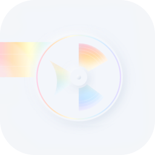

  

capta is a desktop audio recorder and visualizer.	  
it uses wasapi loopback to record any incoming audio.	  

**buttons**
- record
- visualizer cycle
- reel spin

**slider**	
- hue	

**visualizers**		
- bars	
- scope	
- spectral	

this program is free and [donations are welcome](https://ko-fi.com/geltz)

